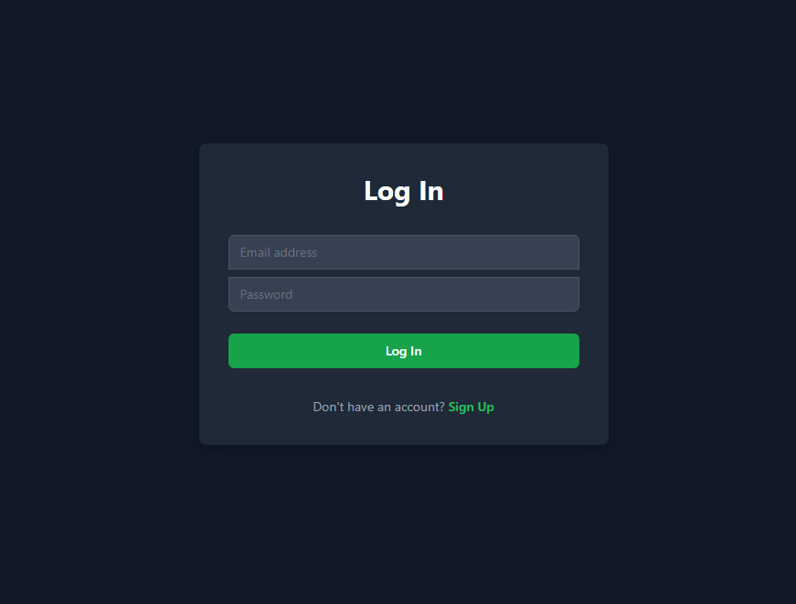
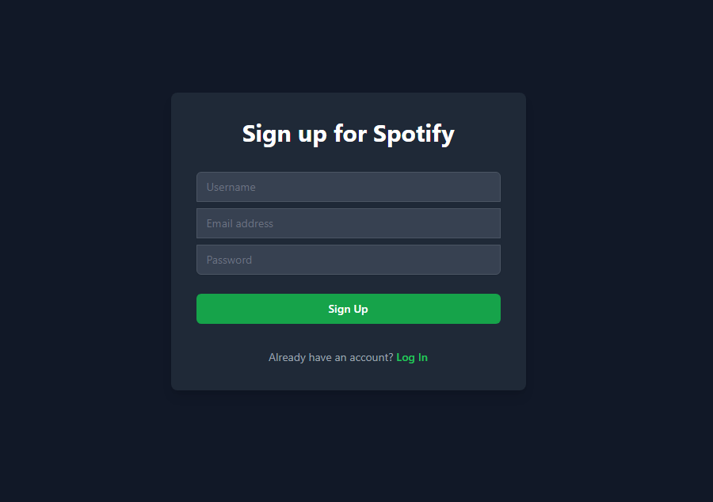
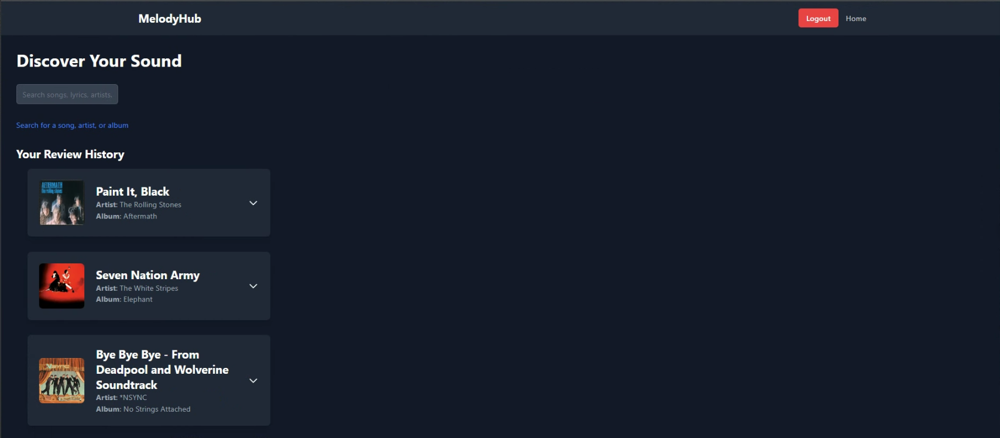
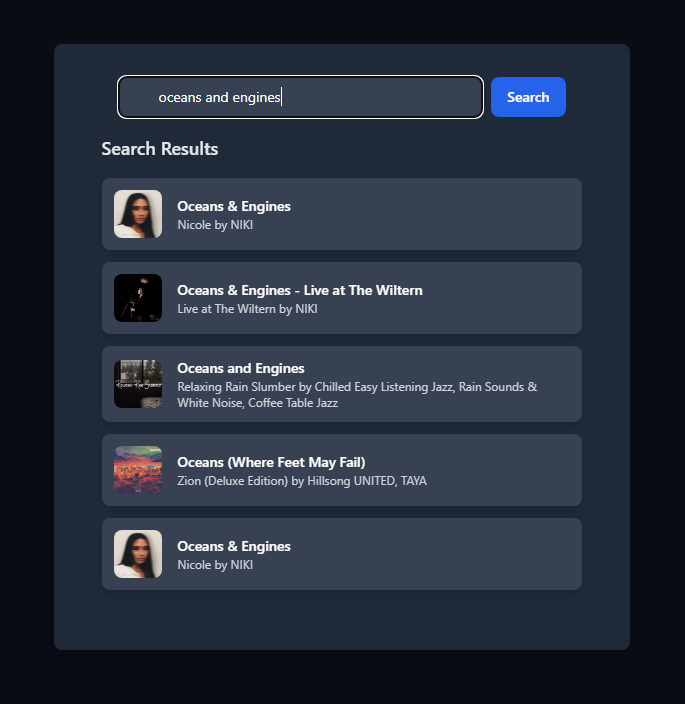
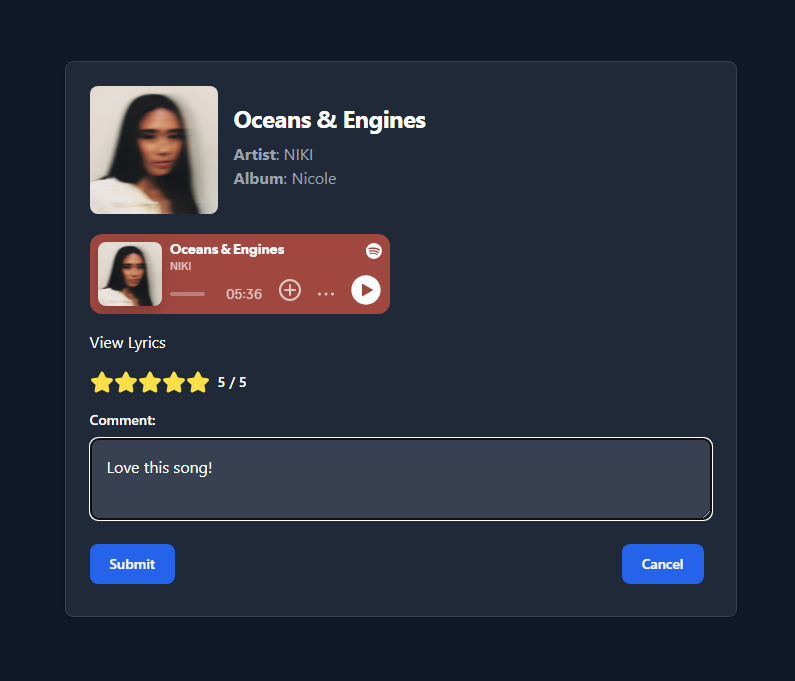

# MelodyHub

Welcome to **MelodyHub**, your ultimate destination for discovering and sharing your favorite music. This project is designed to provide a seamless and engaging experience for music enthusiasts.

## Description

**MelodyHub** is a music social media web application that allows users to search for songs, listen to them alongside lyrics, and post their ratings to their profiles. We utilized the **Spotify Web API** and **Genius API** for accessing a vast library of music and lyrics. To secure user accounts, **JWT authentication** was implemented.

## Table of Contents

- [Features](#features)
- [Installation](#installation)
- [Usage](#usage)
- [Contributing](#contributing)
- [Technologies](#technologies)
- [Links](#links)

## Features

- **User Authentication**: Secure login and signup functionality.
- **Music Search**: Search for songs, artists, and albums.
- **User Reviews**: Write and share reviews for your favorite songs.
- **Responsive Design**: Optimized for both desktop and mobile devices.
- **Spotify Integration**: Blends with the Spotify theme for a familiar user experience.

## Installation

To get started with **MelodyHub**, follow these steps:

1. **Visit the MelodyHub Website**:  
   Please follow this link to visit the MelodyHub website: https://group-2-project.onrender.com/

2. **Login or Create a New Account**:  
   If you have used **MelodyHub** before, please log in with your credentials. If you are new, create an account using your desired username, email, and password.

   
     

   After completing these steps, welcome to **MelodyHub**!

## Usage

After logging in, you will land on **MelodyHub's** homepage. If you’ve used the app before, you will see some of your previous song reviews displayed on the homepage. If you’re a new user, it’s time to write some reviews!

1. **Search for a Song**:  
   Click on the search bar to browse through Spotify’s library of songs.

2. **Select a Song**:  
   Once you’ve found the song you want, click on the search result, and you will be navigated to the song’s review page.

3. **Review the Song**:  
   On the review page, you can listen to the song and read its lyrics to help formulate your opinion. When ready, select the number of stars you rate the song, leave a comment, and click "Submit." Your review will now appear on your home screen.

   Continue using **MelodyHub** to catalog your favorite (and perhaps not-so-favorite) songs!

     
     
   

## Contributing

Developed by:
- Mehdi Azar
- Cyrus Esfanhani
- Daniel Olaes
- Robert Rodriguez

Starter code provided by UCI Software Engineering Boot Camp.

## Technologies

### APIs Used:
- Spotify Web API
- Genius API

### Development Tools:
- Node.js
- React.js
- Express
- TypeScript
- JavaScript
- HTML
- TailwindCSS / Flowbite Component Library
- PostgreSQL
- Render

## Links

- **GitHub Repository**: https://github.com/CyrusEsfahani/group-2-project
- **Render Deployment**: https://group-2-project.onrender.com/
